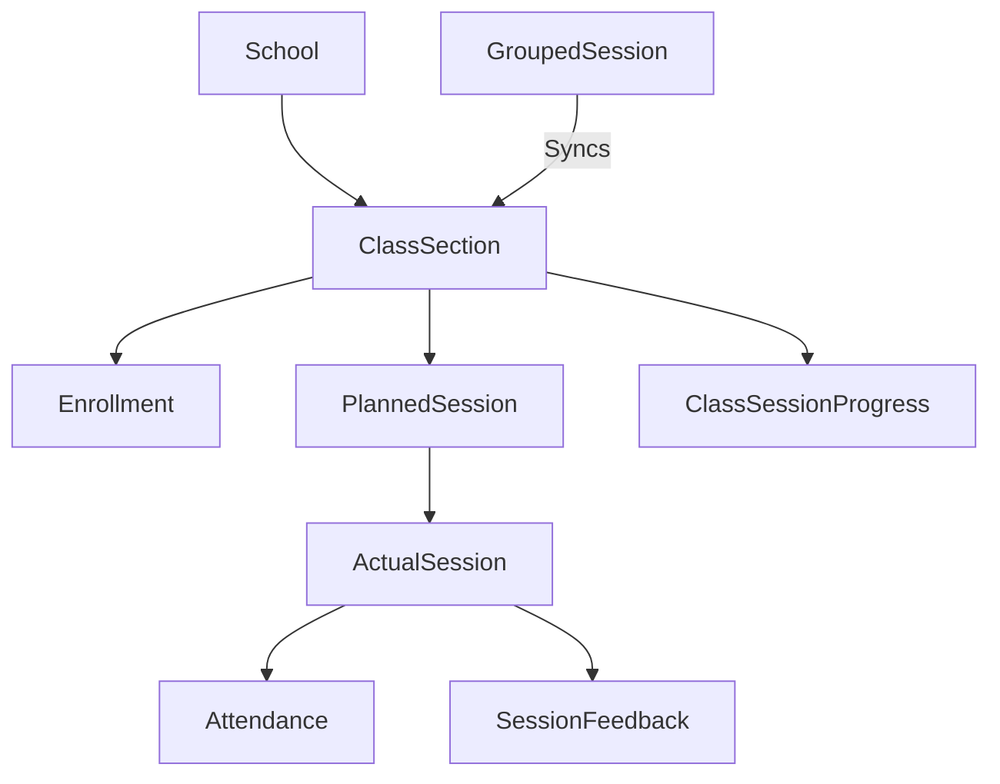

# Session Architecture & Curriculum Flow Summary

This document provides a technical overview of how "Today's Session" is structured and how the curriculum sequence (Days 1-150) flows in the CLAS system.

## 1. Core Connection Tables (Database Schema)

| Model Name | Purpose | Key Relationships |
| :--- | :--- | :--- |
| **School** | The root entity representing a physical school. | Links to [ClassSection](file:///c:/Users/piyus/CLAS/CLAS/class/models/class_section.py#5-48) and [FacilitatorSchool](file:///c:/Users/piyus/CLAS/CLAS/class/models/facilitor_school.py#8-45). |
| **ClassSection** | A specific grade/section (e.g., Grade 5A). | Belongs to a [School](file:///c:/Users/piyus/CLAS/CLAS/class/models/facilitor_school.py#8-45). |
| **PlannedSession** | Definition of a "Day" in the curriculum (1-150). | Linked to a [ClassSection](file:///c:/Users/piyus/CLAS/CLAS/class/models/class_section.py#5-48) or [GroupedSession](file:///c:/Users/piyus/CLAS/CLAS/class/models/students.py#30-74). |
| **GroupedSession** | Permanent grouping of multiple classes. | Links multiple [ClassSection](file:///c:/Users/piyus/CLAS/CLAS/class/models/class_section.py#5-48)s to a single master session set. |
| **ActualSession** | Physical execution of a session on a specific date. | Links [PlannedSession](file:///c:/Users/piyus/CLAS/CLAS/class/models/students.py#134-240), [Facilitator](file:///c:/Users/piyus/CLAS/CLAS/class/models/facilitor_school.py#8-45), and `Date`. |
| **Attendance** | Student-level participation record. | Linked to [ActualSession](file:///c:/Users/piyus/CLAS/CLAS/class/models/students.py#320-455) and [Student](file:///c:/Users/piyus/CLAS/CLAS/class/models/students.py#79-92). |
| **ClassSessionProgress**| High-level "source of truth" for class progress. | Updated when a session is **Conducted** or **Cancelled**. |

### Connection Diagram (Logical)

---

## 2. Curriculum Flow Sequence

The system follows a strict 1-150 day sequence. The transparency of this flow is managed by the [SessionSequenceCalculator](file:///c:/Users/piyus/CLAS/CLAS/class/session_management.py#51-467).

### How the "Next Day" is Determined:
1. **Today's Buffer**: If a session (ActualSession) was already created **today**, the system remains on that session (Day X) for the rest of the day. It does NOT advance immediately.
2. **Midnight Advance**: Tomorrow, the system checks the [ClassSessionProgress](file:///c:/Users/piyus/CLAS/CLAS/class/models/students.py#457-490). If the last record is [completed](file:///c:/Users/piyus/CLAS/CLAS/class/models/students.py#1404-1413), it increments `Day X + 1`.
3. **Status Rules**:
    - **CONDUCTED**: Session finished. Advance to next day tomorrow.
    - **CANCELLED**: Session skipped. Advance to next day tomorrow.
    - **HOLIDAY**: School closed. **Repeats the same day** tomorrow.
4. **Grouped Advancement**: In a grouped class (e.g., 5A and 5B joined), when the facilitator completes the session for the group, progress is synced across all classes in that group.

### Facilitator Continuation
Special logic tracks where an individual facilitator left off if they move between different schools or classes, ensuring they always see the "Next Pending" session relative to their own teaching history within that specific class context.
